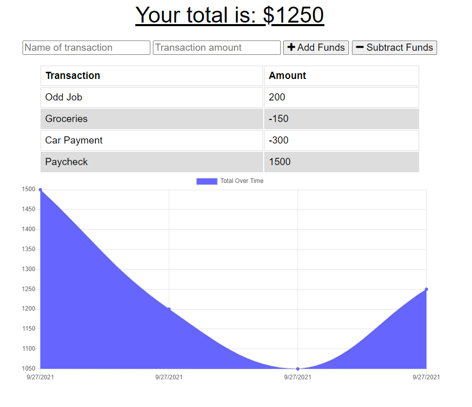

# PWA Budget Tracker

## Description

Budget Tracker is a Progressive Web Application that allows the user to track transctions for their bank account. The appliction can be run from the browser, whether an internet conenction is present or not, or installed to their desktop. Once a connection is established, all transactions are syncronized into one database.

[Deployed Application](https://pwa-budget-tracker-spreston4.herokuapp.com/)

[GitHub Repo](https://github.com/spreston4/pwa-budget-tracker)

## Technologies Used

Built in Visual Studio with:
* Node.js
* Express
* MondoDB
* Mongoose
* Heroku
* IndexedDB

## How To

Upon starting the application, the user will see the following screen. Simply enter a transaction name, the transaction ammount, and click either 'Add Funds' or 'Subtract Funds' to submit your transaction. Upon clicking, the application will calculate your new total and add the transaction to the transaction list.

To install the application for use from your desktop, click the computer icon from your browser's address bar, and follow the install prompts.

## Business Context

Giving users a fast and easy way to track their money is important, but allowing them to access that information anytime is even more important. Having offline functionality is paramount to our applications success.

## User Story

AS AN avid traveller
I WANT to be able to track my withdrawals and deposits with or without a data/internet connection
SO THAT my account balance is accurate when I am traveling

## Acceptance Criteria

GIVEN a user is on Budget App without an internet connection
WHEN the user inputs a withdrawal or deposit
THEN that will be shown on the page, and added to their transaction history when their connection is back online.

## Contact Me

Contact me via e-mail, or check out my GitHub!

* GitHub: [spreston4](https://github.com/spreston4)
* E-mail: [sam.preston11@gmail.com](mailto:sam.preston11@gmail.com)